# Отчёт к лабораторной работе №1
## Основы командной строки Linux
---
### 1. Создание виртуальной машины
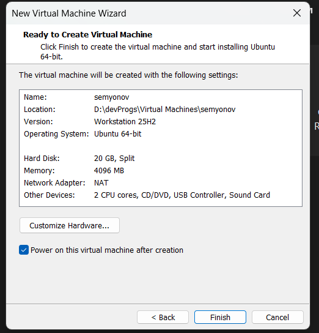
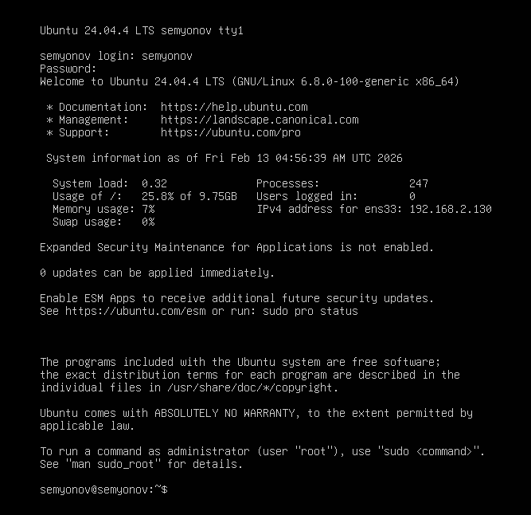
---
### 2. Информация о системе
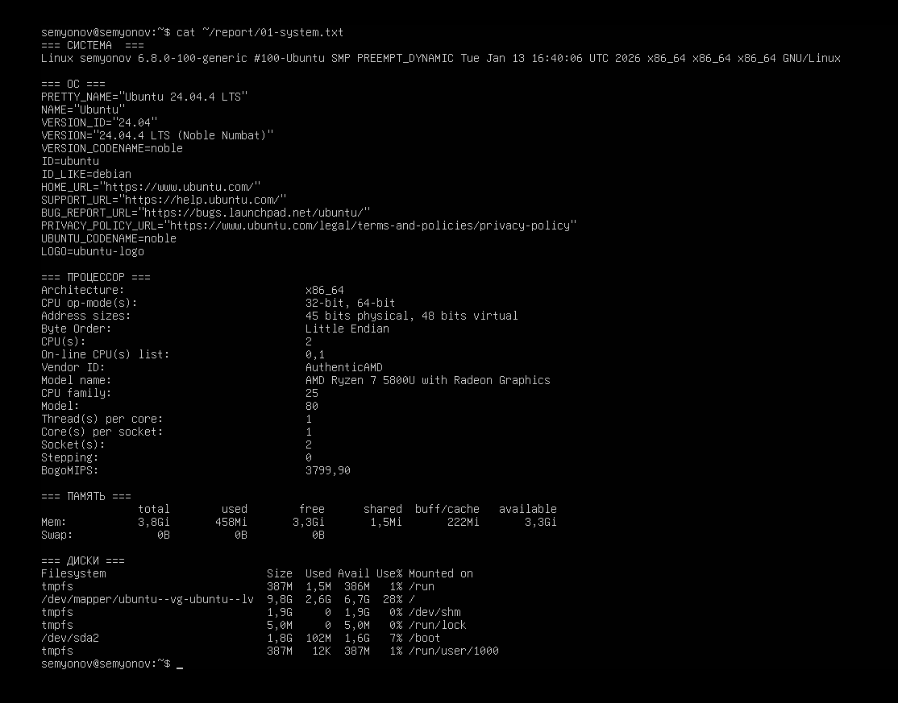
---
### 3. Сеть: IP-адрес и открытые порты
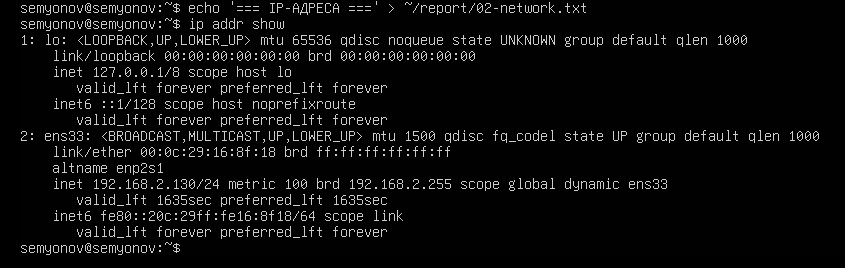
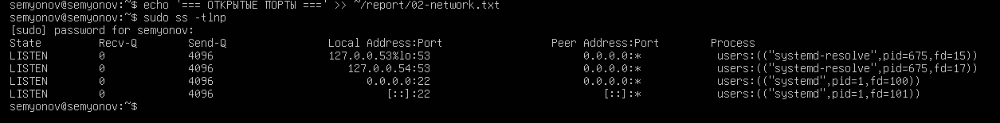
---
### 4. Сервис SSH
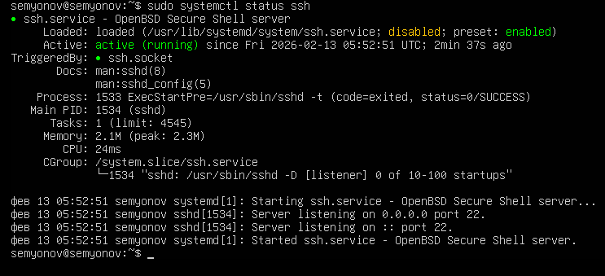

---
### 5. Пользователи и группы

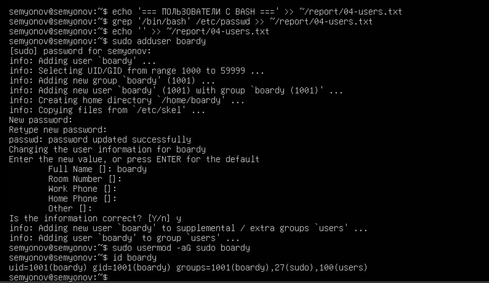
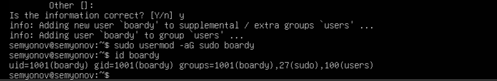
---
### 6. Дерево каталогов
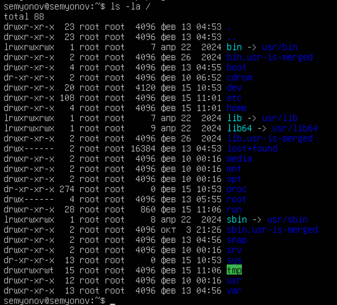
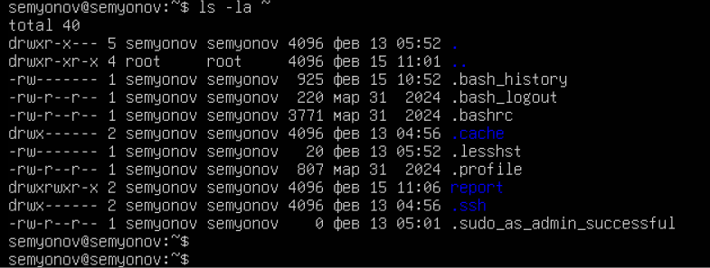
---
### 7. Права доступа
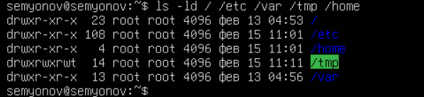
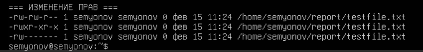
---
### 8. Установленные пакеты и сервисы
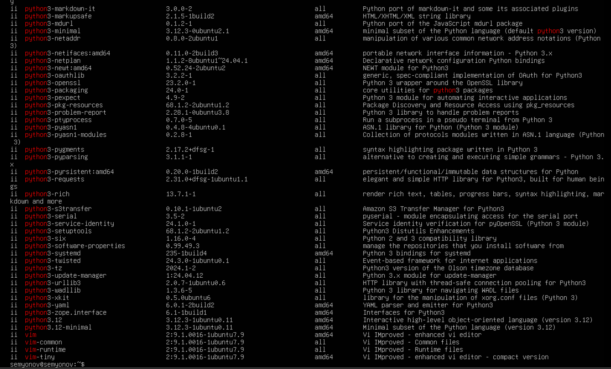
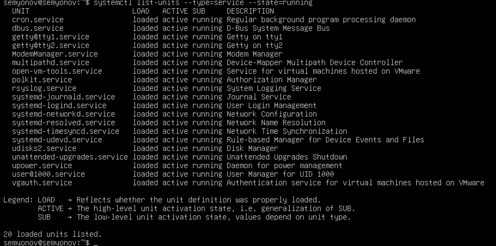
---
### 9. Конвейер и перенаправление
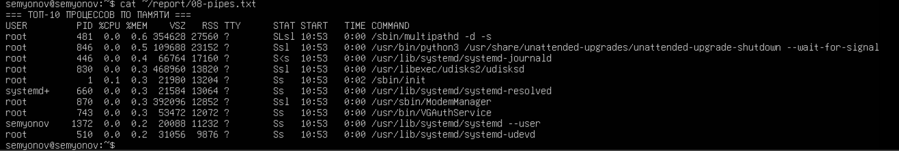
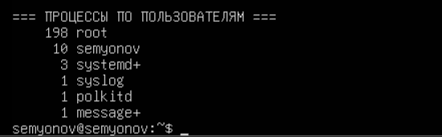

---
### 10. Итоговый файл
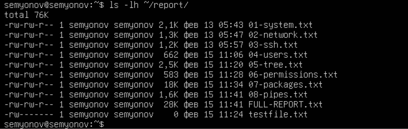
