# Отчёт к лабораторной работе №5 Семёнов В.А
## HTTPS
### 1. Установка certbot
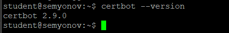
---
### 2. Получение сертификата
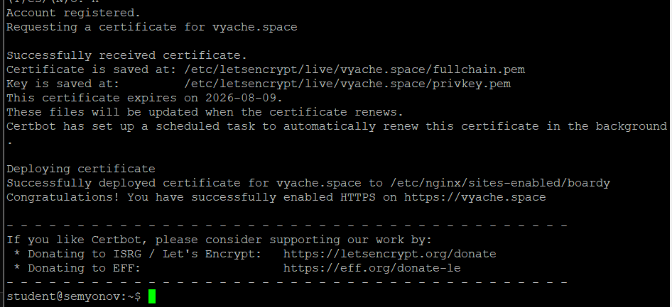
---
### 3. Проверка в браузере
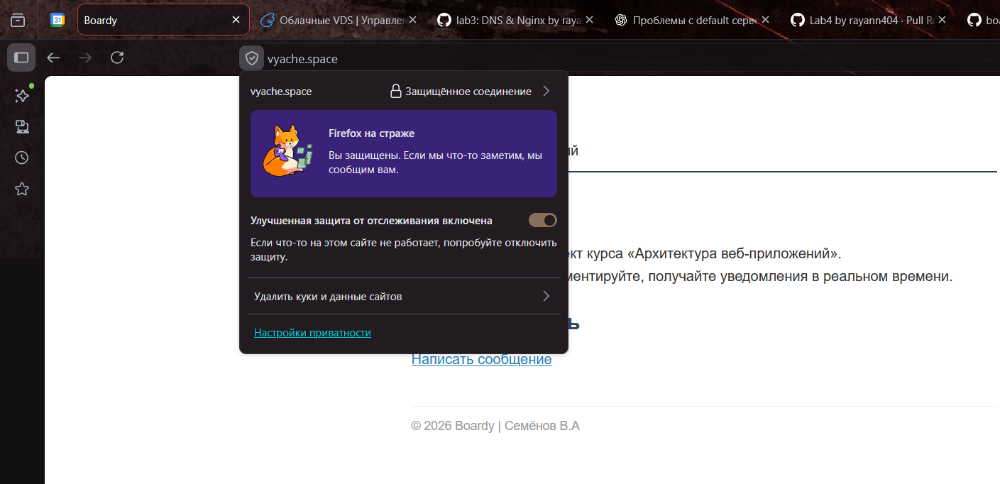
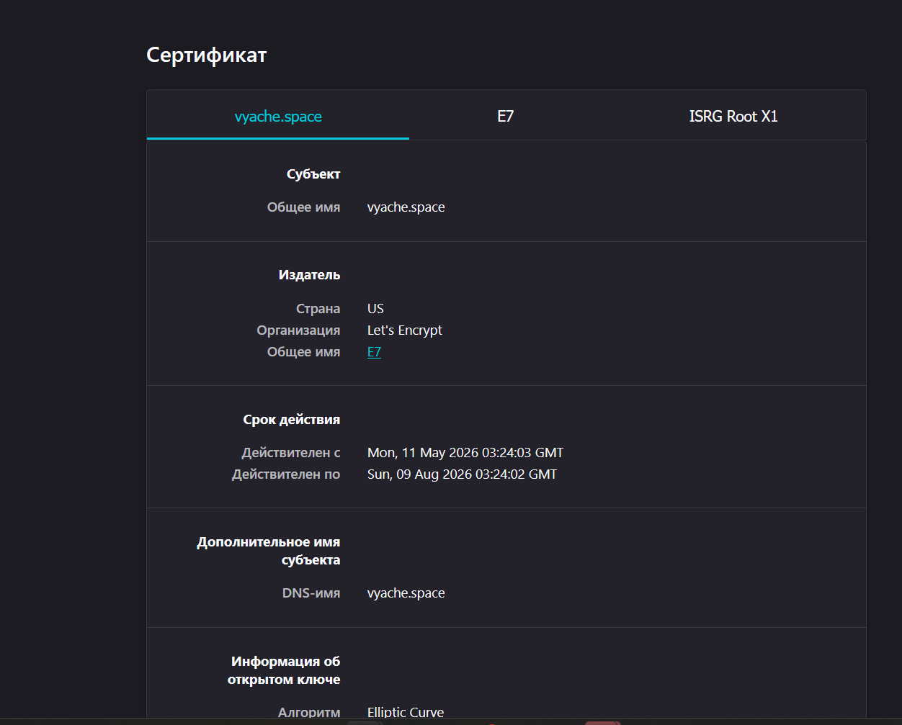
---
### 4. Редирект
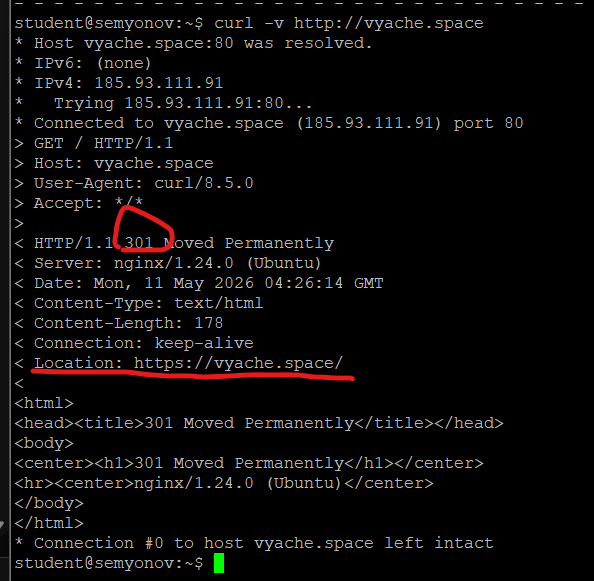
---
### 5. Конфиг после certbot
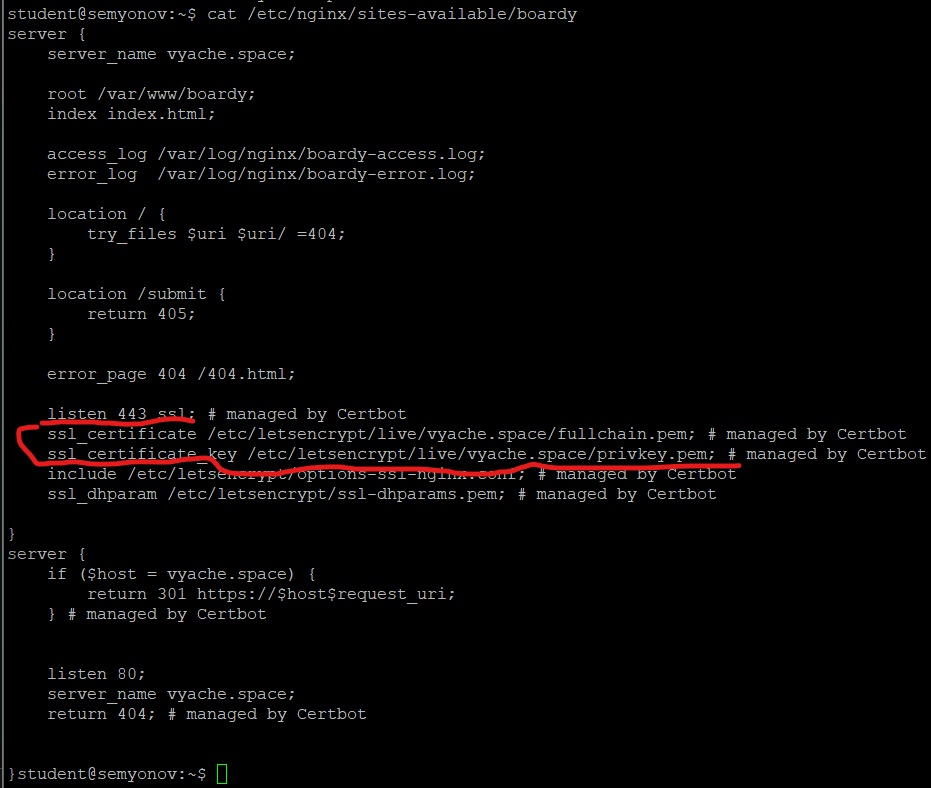
---
### 6. Сертификат для api-поддомена
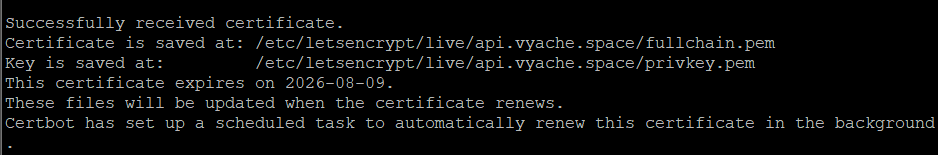
---
### 7. Проверка обоих доменов
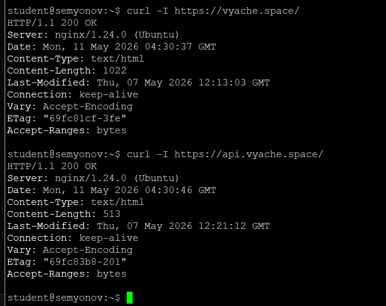
### 8. TLS handshake

### 9. Цепочка доверия
vyache.space → Let's Encrypt → ISRG Root X1
	Браузер проверяет с конца, сертф подписан, летс енкрипт подписан. Если во всех точках всё ок, то появляется замочек
  
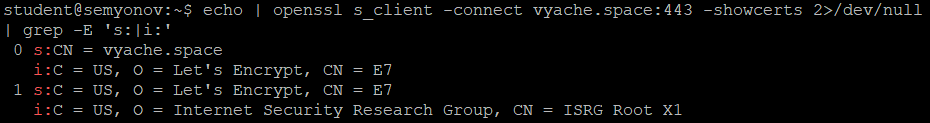
### 10. Сравнение сертификатов
Исходя из вывода, трудно сказать, что именно у них общего, кроме даты выдачи и даты истечения срока. Разные -- параметр subject, который указывает на домен, которому принадлежит сертификат. Поэтому можно сказать, что сертификаты разные и выпущены отдельно на vyache.space & api.vyache.space

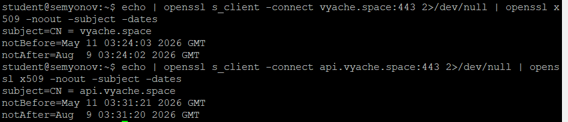
### 11. HSTS
Браузер запомнит, что подключение к данному домену только по HTTPS, поэтому во все последующие разы он будет исправлять любой запрос к этому домену, заменяя протокол на Https
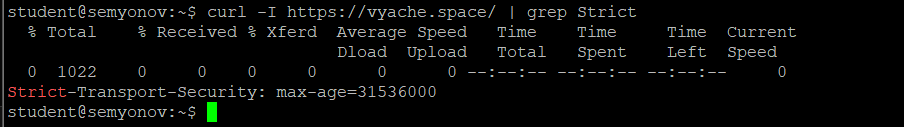
### 12. Кэширование и gzip
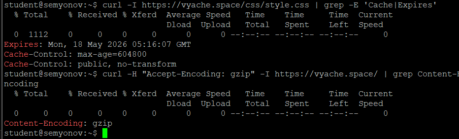
### 13. Автообновление
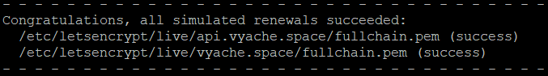
### 15. PR
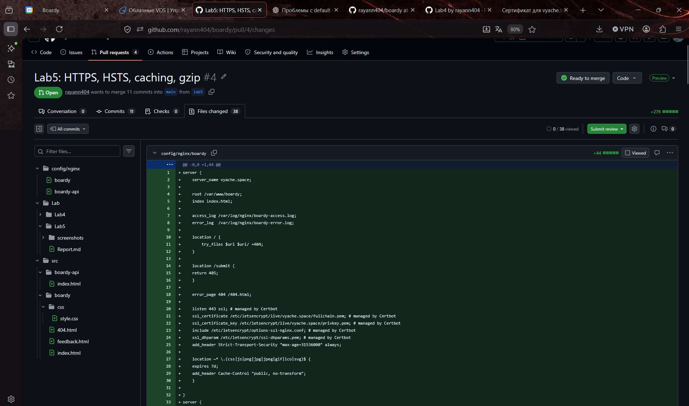
